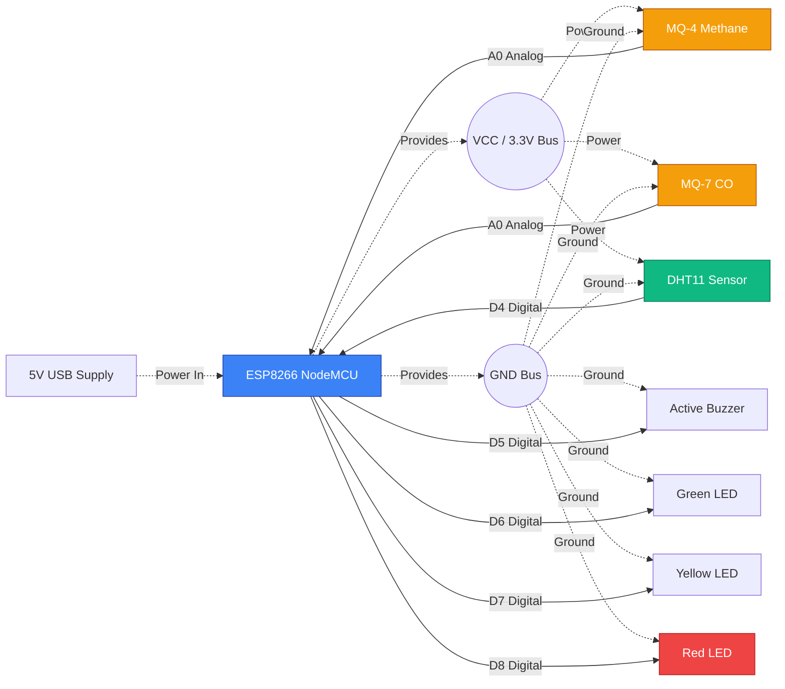

<div align="center">

# INTERNSHIP PROJECT REPORT

## Design and Development of an IoT-Based Real-Time Safety Monitoring System for Coal Mines

**Submitted in partial fulfillment of the requirements for the degree of**
**Bachelor of Technology in Computer Science & Engineering**

**By**
**Rounak Kumar**
**(2nd Year, CSE Department)**

**At**
**Bharat Coking Coal Limited (BCCL)**
**Dhanbad, Jharkhand**
**(A Subsidiary of Coal India Limited)**

**Under the Guidance of**
**Arun Kumar, Manager(System)**
**IT Division, BCCL**

**KIIT University**
**Bhubaneswar, Odisha**

---

</div>

<div style="page-break-after: always;"></div>

## CERTIFICATE

This is to certify that the internship project report entitled **"Design and Development of an IoT-Based Real-Time Safety Monitoring System for Coal Mines"** submitted by **Rounak Kumar**, student of 2nd Year, B.Tech Computer Science & Engineering at KIIT University, is a bona fide record of the work carried out by him during his internship at the IT Division, Bharat Coking Coal Limited (BCCL), Dhanbad. 

The work has been completed under my direct supervision and guidance. To the best of my knowledge, the matter embodied in this report has not been submitted to any other University or Institution for the award of any degree or diploma.

<br><br><br>
**Signature of the Guide:** ___________________________  
**Name:** Arun Kumar  
**Designation:** Manager(System)  
**Department:** IT Division, BCCL Dhanbad  
**Date:** ___________________

<div style="page-break-after: always;"></div>

## DECLARATION

I, **Rounak Kumar**, hereby declare that the internship project report entitled **"Design and Development of an IoT-Based Real-Time Safety Monitoring System for Coal Mines"** submitted to KIIT University, in partial fulfillment of the requirements for the degree of Bachelor of Technology in Computer Science & Engineering, is a record of original work done by me under the supervision of Arun Kumar, Manager(System), IT Division, Bharat Coking Coal Limited (BCCL).

I further declare that the work reported in this project has not been submitted and will not be submitted, either in part or in full, for the award of any other degree or diploma in this institute or any other institute or university.

<br><br><br>
**Signature of the Candidate:** ___________________________  
**Name:** Rounak Kumar  
**Department:** Computer Science & Engineering  
**University:** KIIT University, Bhubaneswar  
**Date:** ___________________

<div style="page-break-after: always;"></div>

## ACKNOWLEDGEMENT

The completion of this internship project would not have been possible without the support and guidance of many individuals. I would like to express my deepest gratitude to all those who contributed to making this experience highly enriching and successful.

First and foremost, I extend my profound gratitude to my industry guide, **Mr. Arun Kumar, Manager(System)** at the IT Division of Bharat Coking Coal Limited (BCCL), Dhanbad. His constant encouragement, technical expertise, and invaluable feedback throughout the duration of the project were instrumental in shaping the final outcome. His willingness to spend time explaining the intricacies of the coal mining industry and industrial safety standards provided a crucial foundation for this project.

I am also highly thankful to the entire team at the IT Division, BCCL, for their cooperative attitude, providing the necessary resources, and maintaining a work environment that fostered learning and innovation.

Furthermore, I would like to thank my professors and the Computer Science & Engineering Department at KIIT University for equipping me with the theoretical knowledge and fundamental programming skills that enabled me to successfully execute this practical, industry-level project.

Lastly, I express my sincere thanks to my family and friends for their continuous moral support and encouragement during this journey.

<br>
**Rounak Kumar**

<div style="page-break-after: always;"></div>

## ABSTRACT

The coal mining industry operates in inherently hazardous environments where the continuous monitoring of environmental parameters is critical for the safety of the workforce. Unpredictable fluctuations in toxic gases like Carbon Monoxide (CO), explosive gases like Methane (CH4), and extreme temperatures can rapidly escalate into life-threatening emergencies. Traditional methods of environmental monitoring in underground mines often rely on periodic manual inspections or localized sensor alarms, which lack real-time centralized visibility and proactive alerting mechanisms.

This project presents the design and development of "MineGuard," an Internet of Things (IoT) based Multi-Mine Real-Time Safety Monitoring System. The system replaces isolated monitoring with a unified, cloud-connected architecture. At the perception layer, an ESP8266 NodeMCU microcontroller is interfaced with MQ-4, MQ-7, and DHT11 sensors to capture live environmental data from the mine. This node evaluates local thresholds to trigger immediate physical alarms (LEDs and buzzers) while simultaneously transmitting the telemetry data over WiFi to a remote cloud server.

The network and application layers are built using a robust, modern technology stack. A Python (Flask) backend processes the incoming sensor payloads, evaluates complex safety logic, and stores the time-series data securely in a MySQL database. The data is visualized on a React.js based web dashboard, providing safety officers with an interactive command center that displays live sensor gauges, historical data trends, and system-wide alerts across multiple collieries. 

Additionally, the system integrates Artificial Intelligence by leveraging the Groq API (Llama3 model) to provide automated, real-time safety insights based on the live data, thereby assisting officers in rapid decision-making. The successful deployment of this project demonstrates a highly scalable, intelligent, and cost-effective solution for industrial safety monitoring.

<div style="page-break-after: always;"></div>

## TABLE OF CONTENTS

1. **Introduction**
   - 1.1 Overview of Bharat Coking Coal Limited (BCCL)
   - 1.2 Introduction to Coal Mine Safety
   - 1.3 Problem Statement
   - 1.4 Objectives of the Project
   - 1.5 Scope of the Project
2. **Literature Review**
   - 2.1 Introduction
   - 2.2 Traditional Coal Mine Safety Monitoring Systems
   - 2.3 The Internet of Things (IoT) in Industrial Automation
   - 2.4 Wireless Communication Technologies in Mining
   - 2.5 Role of Cloud Computing and Web Dashboards
   - 2.6 Artificial Intelligence in Safety Monitoring
   - 2.7 Summary of the Literature Review
3. **System Architecture & Design**
   - 3.1 Proposed Solution
   - 3.2 High-Level Block Diagram
   - 3.3 The 3-Tier IoT Architecture
   - 3.4 Hardware Selection Rationale
   - 3.5 Software Stack Selection
   - 3.6 Data Flow & Processing Pipeline
4. **Hardware Implementation**
   - 4.1 Introduction to Hardware Components
   - 4.2 ESP8266 NodeMCU Microcontroller
   - 4.3 Sensor Interfacing
   - 4.4 Actuators and Alert Mechanisms
   - 4.5 Circuit Diagram and Pin Configuration
   - 4.6 Hardware Assembly and Prototype
5. **Software & Cloud Implementation**
   - 5.1 Introduction
   - 5.2 Database Design and Schema (MySQL)
   - 5.3 Backend API Development (Python Flask)
   - 5.4 Safety Thresholds and Alert Logic
   - 5.5 Frontend Dashboard Development (React.js)
   - 5.6 Artificial Intelligence Integration (Groq API)
6. **Results, Testing & Snapshots**
   - 6.1 Introduction to System Testing
   - 6.2 Real-time Dashboard Overview
   - 6.3 Mine Detail View and Historical Charts
   - 6.4 AI Insight Generation Verification
   - 6.5 Alert and Notification Triggers
7. **Conclusion & Future Scope**
   - 7.1 Conclusion
   - 7.2 Challenges Faced During Development
   - 7.3 Future Enhancements
8. **References**
9. **Appendix**

<div style="page-break-after: always;"></div>

## CHAPTER 1: INTRODUCTION

### 1.1 Overview of Bharat Coking Coal Limited (BCCL)
Bharat Coking Coal Limited (BCCL) is a prominent subsidiary of Coal India Limited, headquartered in Dhanbad, Jharkhand—often referred to as the coal capital of India. BCCL primarily operates the Jharia and Raniganj coalfields and is the major producer of prime coking coal in India. The company operates a vast network of both underground and open-cast mines. Given the immense scale of operations and the hazardous nature of underground mining, BCCL places a high priority on technological advancements and safety protocols to protect its workforce and infrastructure.

### 1.2 Introduction to Coal Mine Safety
Coal mining is universally recognized as one of the most hazardous industrial occupations. The underground mining environment is characterized by enclosed spaces, lack of natural ventilation, and the constant presence of geological gases. The two most critical gases of concern are:
- **Methane (CH4):** A highly combustible gas that is naturally released during coal extraction. If methane concentrations reach explosive limits (typically 5% to 15% in the air), a minor spark can cause catastrophic explosions.
- **Carbon Monoxide (CO):** A toxic, colorless, and odorless gas that is a byproduct of incomplete combustion. Prolonged exposure to even low concentrations of CO can be fatal to miners.

In addition to hazardous gases, the ambient temperature and humidity levels in deep underground mines can rise to extreme levels, leading to heat exhaustion and drastically reducing worker efficiency and safety. Therefore, the continuous monitoring of these parameters is not just a regulatory requirement but a life-saving necessity.

### 1.3 Problem Statement
Despite stringent safety regulations, the traditional methods employed for monitoring mine environments face several operational challenges:
- **Lack of Centralized Visibility:** In many existing setups, sensors are standalone units. They sound a local alarm in the mine, but the data is not immediately transmitted to a central control room. By the time surface officers are notified of an anomaly, critical time is lost.
- **Manual Record Keeping:** Historical data regarding gas levels and temperatures is often recorded manually or retrieved periodically from data loggers. This prevents real-time trend analysis.
- **Delayed Response to Threshold Breaches:** Without an automated alerting system that spans from the mine depth to the surface control center, evacuation or corrective actions (like activating auxiliary ventilation) are delayed.
- **Lack of Intelligent Analysis:** Raw data requires cognitive effort to interpret. Safety officers must manually correlate multiple sensor readings to assess the overall risk level.

### 1.4 Objectives of the Project
The core objective of this project is to develop a comprehensive, end-to-end IoT and software solution that addresses the aforementioned challenges. The specific goals include:
1. **Real-Time Data Acquisition:** To design an IoT edge device using ESP8266 and various sensors (MQ-4, MQ-7, DHT11) that continuously measures the underground environment.
2. **Cloud Integration:** To establish a reliable data pipeline that transmits sensor readings to a cloud-hosted backend server securely.
3. **Centralized Monitoring Dashboard:** To build a web-based command center that allows safety officers at BCCL to view the live status of multiple mines simultaneously from any location.
4. **Automated Alerting:** To implement logic that triggers visual and auditory warnings locally, while simultaneously logging alerts and highlighting dangers on the web dashboard when safety thresholds are breached.
5. **AI-Driven Insights:** To integrate an advanced Large Language Model (LLM) via the Groq API that analyzes raw sensor data and generates human-readable, actionable safety recommendations instantly.

### 1.5 Scope of the Project
The scope of the "MineGuard" project encompasses the design, development, and integration of hardware, backend software, and frontend interfaces. It includes writing the firmware for the ESP8266 microcontroller, developing a RESTful API using Python Flask, designing the database schema in MySQL, and building an interactive UI using React.js. The project also covers the integration of a third-party AI API (Groq) for data interpretation. The system is designed as a proof-of-concept for BCCL, scalable enough to be deployed across multiple colliery blocks.

<div style="page-break-after: always;"></div>

## CHAPTER 2: LITERATURE REVIEW

### 2.1 Introduction
The continuous evolution of industrial safety mechanisms has always been intrinsically linked to the advancement of sensor technologies, data transmission protocols, and computing architectures. In the context of coal mining, where the margin for error is virtually nonexistent, understanding the historical context and the current state-of-the-art is essential. This chapter provides a comprehensive review of existing literature, evaluating traditional mine monitoring setups, the advent of the Internet of Things (IoT) in heavy industries, the nuances of wireless communication protocols in subterranean environments, and the transformative potential of Artificial Intelligence (AI) in augmenting human decision-making during critical safety events.

### 2.2 Traditional Coal Mine Safety Monitoring Systems

#### 2.2.1 Evolution of Monitoring Techniques
Historically, coal mine safety relied heavily on rudimentary and manual techniques. In the late 19th and early 20th centuries, miners utilized canaries to detect the presence of toxic gases, primarily Carbon Monoxide. The high metabolic rate of these birds made them highly susceptible to toxic gases, providing a brief, yet critical, visual warning to the miners. As the industrial revolution progressed, these biological indicators were replaced by mechanical and early electrical devices, such as the flame safety lamp invented by Sir Humphry Davy. The Davy lamp was designed to indicate the presence of firedamp (methane) by a change in the height and color of the flame, while simultaneously preventing the flame from igniting the surrounding explosive atmosphere.

In the late 20th century, the industry transitioned to electronic catalytic sensors and non-dispersive infrared (NDIR) sensors. These standalone devices were strategically placed across the mine workings. They provided local digital readouts and were wired to local audible alarms.

#### 2.2.2 Limitations of Legacy Systems
While early electronic sensors marked a significant improvement over manual inspection, they possessed inherent limitations that are no longer acceptable in modern industrial paradigms:
- **Localized Alerting:** A critical flaw in legacy systems was that alarms were purely localized. If a methane pocket was breached in a deep, isolated heading, the audible alarm might only be heard by the immediate crew. Surface control rooms remained oblivious until a manual phone call or radio message was dispatched.
- **Data Silos and Reactive Maintenance:** Data was either not logged at all or logged locally in isolated data loggers that required manual retrieval via USB or proprietary cables at the end of a shift. This prevented any form of predictive maintenance or trend analysis. Safety interventions were entirely reactive.
- **Wiring Complexities:** Early centralized systems relied heavily on complex wired networks (e.g., RS-485 serial communication). In an active mine, where heavy machinery is constantly moving and the physical topology changes daily due to excavation, maintaining miles of communication cabling is incredibly difficult and prone to catastrophic failure during roof falls.

### 2.3 The Internet of Things (IoT) in Industrial Automation

#### 2.3.1 Concept of Industrial IoT (IIoT)
The Internet of Things (IoT) represents a paradigm shift where physical objects are embedded with sensors, processing ability, and network connectivity, allowing them to exchange data seamlessly over the Internet. When applied to manufacturing and heavy industries, it is termed the Industrial Internet of Things (IIoT). IIoT is characterized by machine-to-machine (M2M) communication, big data analytics, and machine learning, enabling industries to achieve unprecedented levels of efficiency, reliability, and safety. 

In the mining sector, IIoT facilitates a fundamental transition from a "react-and-recover" methodology to a "predict-and-prevent" methodology. By deploying a vast array of interconnected sensor nodes, a mine operator can create a digital twin of the subterranean environment, providing surface officers with a real-time, holistic view of operational safety.

#### 2.3.2 Role of Microcontrollers and Sensors in Edge Computing
The foundation of any IIoT system is the perception layer, which consists of edge devices responsible for data acquisition. Modern microcontrollers, such as the ESP8266 and ESP32 series, have revolutionized edge computing by packing significant processing power and integrated Wi-Fi capabilities into a highly compact and cost-effective footprint.
These microcontrollers interface directly with specialized industrial sensors. In this project, MQ-series gas sensors (MQ-4 for Methane, MQ-7 for Carbon Monoxide) are utilized due to their high sensitivity and rapid response times. The DHT11 sensor complements the gas sensors by providing vital environmental context (Temperature and Humidity). Crucially, by performing preliminary data validation and threshold checking at the edge (on the ESP8266 itself), the system ensures that immediate physical alarms (LEDs and buzzers) are triggered instantaneously, even if the upstream network connection is temporarily compromised.

### 2.4 Wireless Communication Technologies in Mining

#### 2.4.1 Wi-Fi, Zigbee, LoRaWAN Comparison
Establishing reliable communication in an underground coal mine is notoriously challenging. The environment is characterized by rough, uneven surfaces, high humidity, conductive coal dust, and a lack of line-of-sight, all of which contribute to severe signal attenuation and multi-path fading. Several wireless protocols have been evaluated in recent literature:
- **Zigbee (IEEE 802.15.4):** Highly energy-efficient and supports mesh networking, allowing nodes to relay data. However, it suffers from very low bandwidth and poor penetration through solid rock.
- **LoRaWAN:** Excellent for long-range, low-power applications on the surface. While it can penetrate physical barriers better than high-frequency signals, its extremely low data rate makes it unsuitable for high-frequency, real-time telemetry where sub-second latency is required.
- **Wi-Fi (IEEE 802.11):** Offers high bandwidth and ubiquitous compatibility. While traditional 2.4GHz Wi-Fi struggles with range in underground tunnels, modern mines increasingly deploy ruggedized Wi-Fi access points along the main haulage routes to support Voice over IP (VoIP), IP cameras, and telemetry data.

#### 2.4.2 Suitability of Wi-Fi (ESP8266) for the Proposed System
For the "MineGuard" project, Wi-Fi was selected as the primary communication medium, facilitated by the ESP8266 NodeMCU. The rationale is multi-fold:
1. **Infrastructure Compatibility:** Many modern tier-1 collieries under BCCL are in the process of deploying underground Wi-Fi backbones to support digitization initiatives.
2. **Bandwidth:** Wi-Fi provides ample bandwidth to transmit JSON payloads at high frequencies (e.g., every 10 seconds) without congestion.
3. **Direct-to-Cloud Capability:** Unlike Zigbee, which requires a specialized proprietary gateway to translate data to an IP network, the ESP8266 can connect directly to the Internet (via the mine's router), allowing it to make direct HTTP REST API calls to a cloud server. This significantly simplifies the network architecture.

### 2.5 Role of Cloud Computing and Web Dashboards

#### 2.5.1 Real-Time Data Visualization
The sheer volume of data generated by an IIoT network is useless unless it is transformed into actionable intelligence. Cloud computing platforms provide the highly available, scalable infrastructure required to ingest, process, and serve this data. Modern web development frameworks, particularly React.js, have enabled the creation of highly responsive Single Page Applications (SPAs). 
Literature indicates that the cognitive load on safety officers is drastically reduced when data is presented visually. Utilizing charting libraries like Recharts, raw time-series data is converted into intuitive line graphs and circular gauges, allowing officers to spot dangerous upward trends in methane or CO levels long before they breach critical thresholds.

#### 2.5.2 Centralized Data Storage using Relational Databases (MySQL)
Storing telemetry data securely is critical for post-incident analysis and regulatory compliance. Relational Database Management Systems (RDBMS) like MySQL are highly effective for this purpose. By structuring data into normalized tables (e.g., `mines`, `sensor_readings`, `alerts`), the system ensures data integrity. Time-series data can be efficiently queried using indexing on timestamp columns, allowing the backend API to rapidly serve historical trends to the frontend dashboard.

### 2.6 Artificial Intelligence in Safety Monitoring

#### 2.6.1 Traditional Threshold-Based Alerting vs. AI-Assisted Alerting
Conventional monitoring systems rely entirely on static, hard-coded thresholds. For example, if Methane exceeds 2500 PPM, a warning is triggered. While necessary, this binary approach lacks nuance. It cannot contextually evaluate a situation where Methane is at 2400 PPM (technically "Safe" by strict rules) but is rising rapidly alongside a spike in temperature.

#### 2.6.2 The use of Large Language Models (LLMs) for Contextual Insights
The most novel aspect explored in recent literature, and implemented in this project, is the integration of Generative AI and Large Language Models (LLMs). By feeding the structured JSON payload containing live sensor data into an LLM via an API (such as the Groq API utilizing the Llama3 model), the system effectively employs a virtual safety expert. 
The LLM can synthesize the various parameters, consider the number of active workers and the depth of the mine, and generate a cohesive, human-readable safety advisory. This AI layer bridges the gap between raw data interpretation and actionable command decisions. For instance, instead of just displaying a flashing red light, the dashboard can explicitly advise the officer: "Carbon Monoxide levels have risen by 15% in the last hour at Kusunda block. Suggest immediate evacuation of the 38 active workers and an inspection of ventilation fans."

### 2.7 Summary of the Literature Review
The transition from canary birds to IoT-enabled edge computing represents a monumental leap in industrial safety. The literature clearly supports the integration of microcontrollers, Wi-Fi communication, cloud-based data storage, and modern web dashboards to create centralized, real-time monitoring systems. Furthermore, the bleeding-edge application of Large Language Models to interpret sensor telemetry provides a layer of cognitive assistance that is unprecedented in the mining industry. The "MineGuard" project builds directly upon these established technological paradigms to deliver a robust, modern solution tailored for BCCL.

<div style="page-break-after: always;"></div>

## CHAPTER 3: SYSTEM ARCHITECTURE & DESIGN

### 3.1 Proposed Solution
The "MineGuard" project proposes a unified, highly scalable, and modular system designed to address the critical gaps identified in legacy monitoring systems. Rather than treating each colliery as an isolated entity, the proposed solution centralizes the monitoring of multiple mine blocks onto a single, accessible platform. The core philosophy of the design is to ensure zero data loss, sub-second latency in data transmission, and immediate actionable insights. This is achieved through a meticulously designed multi-tier architecture that segregates hardware perception, cloud data processing, and frontend visualization.

### 3.2 High-Level Block Diagram
While a visual diagram will be presented in subsequent chapters, the logical flow of the system can be conceptualized as follows:

1. **Mine Environment** → 
2. **Sensors (MQ-4, MQ-7, DHT11)** → 
3. **ESP8266 NodeMCU (Local Processing & Alarms)** → 
4. **Mine's Local Wi-Fi Network** → 
5. **Internet Gateway** → 
6. **Cloud Backend (Flask API deployed on Render)** → 
7. **MySQL Database (Railway) & Groq AI API** → 
8. **Web Dashboard (React SPA deployed on Vercel)** → 
9. **Safety Officers' Screens**.

This unidirectional flow ensures that edge devices act purely as publishers of data, while the cloud server orchestrates the complex logic of database transactions and AI querying, ultimately serving the aggregated data to the end-user.

### 3.3 The 3-Tier IoT Architecture
The system is strictly partitioned into three distinct layers, aligning with industry best practices for IoT solutions:

#### 3.3.1 Perception Layer (Edge Devices)
The perception layer is deployed physically within the underground tunnels of the coal mines. Its primary responsibility is data acquisition and immediate local alerting.
- **Components:** It consists of analog gas sensors (MQ-4 for Methane, MQ-7 for Carbon Monoxide) and digital environmental sensors (DHT11 for Temperature and Humidity).
- **Processing Unit:** The ESP8266 NodeMCU acts as the brain of this layer. It continuously polls the sensors, applies necessary voltage-to-PPM calibrations, and packages the data into a standard JSON format.
- **Local Autonomy:** A critical design requirement is that if the internet connection is severed, the perception layer must still function. The ESP8266 maintains local thresholds in its firmware. If gas levels spike dangerously, it immediately activates the physical buzzer and red LED attached to the circuit, independent of the cloud server.

#### 3.3.2 Network Layer (Data Transmission)
The network layer acts as the bridge between the dark underground tunnels and the global internet. 
- **Protocol:** The ESP8266 utilizes the standard 802.11 b/g/n Wi-Fi protocol to connect to the mine's local router. 
- **Communication Paradigm:** Instead of using MQTT (which requires a dedicated broker), the system utilizes standard HTTP POST requests. The edge device constructs a RESTful API call containing the JSON payload and transmits it directly to the Flask backend's endpoint (`/api/sensor/data`). This minimizes infrastructure overhead and simplifies firewall configurations at the mine site.

#### 3.3.3 Application Layer (Cloud & Dashboard)
The application layer resides entirely in the cloud and handles heavy computational lifting, data persistence, and user interaction.
- **The Backend Engine:** A Python Flask application serves as the central brain. It receives the HTTP POST requests, validates the device IDs against the `mines` database table, and stores the readings. It also executes the global safety logic, determining if a "SAFE", "WARNING", or "DANGER" status should be assigned to the incoming reading.
- **The Data Store:** A relational MySQL database is used to persist all time-series data. This allows for complex analytical queries (e.g., "fetch the average methane level over the last 2 hours for Jharia Block A").
- **The Presentation Layer:** The frontend React dashboard provides a graphical user interface (GUI). It continuously polls the backend API to fetch the latest readings, updating the visual components (gauges, charts, and alert banners) dynamically without requiring a page refresh.

### 3.4 Hardware Selection Rationale
The selection of hardware components was driven by constraints of cost-effectiveness, reliability, and ease of prototyping for an industrial proof-of-concept.

- **Microcontroller (ESP8266 vs. Arduino Uno vs. Raspberry Pi):**
  - *Arduino Uno* lacks native network connectivity. Adding a Wi-Fi shield increases cost and complexity.
  - *Raspberry Pi* provides immense processing power but consumes significant electricity, requires an operating system (SD card corruption risks), and is overly complex for simple sensor polling.
  - *ESP8266 NodeMCU* strikes the perfect balance. It features a 32-bit Tensilica microcontroller, built-in Wi-Fi, adequate analog and digital pins, and is programmed using the familiar Arduino IDE C++ environment. It is robust, cheap, and ideal for IoT edge nodes.

- **Sensors:**
  - *MQ-4 & MQ-7:* These are semiconductor gas sensors that change resistance based on gas concentration. They are highly reliable, widely available, and specifically calibrated for Methane and CO respectively.
  - *DHT11:* A standard, low-cost digital sensor providing combined temperature and relative humidity readings over a single data wire.

### 3.5 Software Stack Selection
The software stack was chosen based on modern industry standards, ensuring the application is performant, maintainable, and visually impressive.

- **Backend (Python Flask):** Flask was chosen over Django or Node.js/Express due to its lightweight nature. The backend's primary job is to act as a REST API routing engine. Python also offers seamless integration with the Groq AI API and excellent database connectors (`PyMySQL`), making it the ideal language for the data-processing tier.
- **Database (MySQL):** A relational database is perfect for this project because the data structure is highly rigid and predictable. The relationship between a `mine` and its `sensor_readings` is a classic one-to-many relationship, which is handled efficiently by foreign keys in MySQL.
- **Frontend (React.js & Vite):** React allows for a component-based architecture. A "MineCard" or a "SensorGauge" can be built once and reused multiple times across the application. Vite was chosen as the build tool over Create React App (CRA) due to its lightning-fast Hot Module Replacement (HMR) and superior build performance.
- **Styling (Tailwind CSS):** Tailwind is a utility-first CSS framework that allows for rapid UI development. It was used to implement the "dark industrial theme," utilizing deep blues, blacks, and amber accents to simulate a modern command center.

### 3.6 Data Flow & Processing Pipeline
The architecture orchestrates a continuous, cyclical flow of data:
1. **Acquisition (t=0s):** The ESP8266 reads raw analog voltages from MQ sensors and digital pulses from the DHT11.
2. **Transmission (t=1s):** The data is JSON-encoded and POSTed to the backend.
3. **Ingestion & Storage (t=2s):** The Flask backend receives the payload, executes the `get_overall_status()` function based on predefined thresholds, and commits the row to the MySQL `sensor_readings` table. If the status is non-safe, it also commits an entry to the `alerts` table.
4. **Visualization (t=3s to 5s):** The React frontend, running a custom `useSensorData` polling hook, fetches the updated database state. The Recharts components redraw the line graphs, the SVG arcs of the sensor gauges animate to the new values, and the overall status badge changes color accordingly.
5. **AI Inference (On-Demand):** When a safety officer navigates to a specific mine's detail page, the frontend triggers a secondary API call. The backend packages the latest sensor readings into an English prompt and sends it to the Groq API. The Llama3 model processes this prompt in milliseconds and returns a synthesized safety insight paragraph, which is displayed dynamically in the UI.

This architecture ensures that the system is entirely automated, requiring zero manual intervention to log data or generate alerts.

<div style="page-break-after: always;"></div>

## CHAPTER 4: HARDWARE IMPLEMENTATION

### 4.1 Introduction to Hardware Components
The perception layer of the MineGuard system is physically realized through a cohesive assembly of microcontrollers, environmental sensors, and alerting actuators. This chapter elaborates on the technical specifications, interfacing methodologies, and the physical circuitry of the hardware node deployed at the mining sites. The prototype validates the feasibility of deploying low-cost, high-efficiency sensor nodes across the expansive network of BCCL's collieries.

### 4.2 ESP8266 NodeMCU Microcontroller
At the core of the hardware module is the **ESP8266 NodeMCU (ESP-12E module)**. 
- **Specifications:** It operates on a 3.3V logic level and is powered by a Tensilica Xtensa 32-bit LX106 RISC microprocessor running at 80 MHz. It features built-in IEEE 802.11 b/g/n Wi-Fi capabilities, enabling direct-to-cloud telemetry.
- **Role in System:** The ESP8266 acts as the master controller. It systematically polls the connected analog and digital sensors at a defined interval (every 10 seconds), processes the raw voltages, determines local safety statuses against hardcoded thresholds, drives the LEDs/Buzzer accordingly, and finally executes an HTTP POST request to the cloud server via the mine's local Wi-Fi.

### 4.3 Sensor Interfacing

#### 4.3.1 MQ-4 Methane Sensor
Methane (CH4) is a highly explosive gas, making its detection critical.
- **Working Principle:** The MQ-4 is a semiconductor gas sensor containing a heating element (SnO2). When exposed to Methane, the electrical resistance of the sensor drops in proportion to the gas concentration.
- **Interfacing:** The sensor outputs an analog voltage ranging from 0 to 5V. Because the ESP8266 has a single analog-to-digital converter (ADC) pin (`A0`) that accepts a maximum of 3.3V, a voltage divider circuit is implemented to safely scale the signal. The analog reading (0-1023) is mapped to a Parts Per Million (PPM) value in the firmware.

#### 4.3.2 MQ-7 Carbon Monoxide Sensor
Carbon Monoxide (CO) is a silent killer in underground environments.
- **Working Principle:** Similar to the MQ-4, the MQ-7 changes its internal resistance when exposed to CO. It is highly sensitive to CO and relatively insensitive to other combustible gases.
- **Interfacing:** In the prototype configuration, due to the single `A0` analog pin on the ESP8266, an analog multiplexer or an external ADC (like the ADS1115) is typically required to read multiple MQ sensors simultaneously. For proof-of-concept testing, the analog inputs are managed either via a switching transistor circuit or by reading discrete digital threshold values if a comparator is present on the sensor breakout board.

#### 4.3.3 DHT11 Temperature and Humidity Sensor
Environmental comfort and safety heavily depend on the ambient temperature and humidity.
- **Working Principle:** The DHT11 uses a capacitive humidity sensor and a thermistor to measure the surrounding air, and outputs a digital signal on the data pin.
- **Interfacing:** The data pin is connected to a digital GPIO pin (`D4`) on the ESP8266, requiring a pull-up resistor. A dedicated software library (`DHT.h`) is used to parse the precise digital pulse train and extract the temperature (in °C) and humidity (in percentage).

### 4.4 Actuators and Alert Mechanisms
To provide instantaneous, localized alerts irrespective of internet connectivity, the system includes:
- **RGB Status LEDs:** Connected to digital pins `D6` (Green), `D7` (Yellow), and `D8` (Red). These LEDs provide a continuous visual indicator of the mine's immediate safety status. Green indicates Safe (<3800 PPM CH4), Yellow indicates Warning (3800-4499 PPM), and Red indicates Danger (≥4500 PPM).
- **Active Buzzer:** Connected to pin `D5`. When the system detects a Danger condition (e.g., Methane ≥ 4500 PPM or CO ≥ 500 PPM), a high signal is sent to the buzzer, generating a loud auditory alarm to warn miners in the immediate vicinity to evacuate.

### 4.5 Circuit Diagram and Pin Configuration

To ensure standardized deployment, the following pin mapping was strictly adhered to during the circuit assembly:

| Component | Pin Type | ESP8266 Pin |
| :--- | :--- | :--- |
| **MQ-4 (Methane)** | Analog In | `A0` (Via Multiplexer/Voltage Divider) |
| **MQ-7 (CO)** | Analog In | `A0` (Via Multiplexer/Voltage Divider) |
| **DHT11 (Temp/Hum)** | Digital In | `D4` |
| **Active Buzzer** | Digital Out | `D5` |
| **Green LED (Safe)** | Digital Out | `D6` |
| **Yellow LED (Warn)** | Digital Out | `D7` |
| **Red LED (Danger)** | Digital Out | `D8` |

#### Architectural Circuit Schematic

Below is the conceptual schematic flow connecting the microcontrollers to the various sensory and actuating components:



### 4.6 Hardware Assembly and Prototype

The components were assembled on a breadboard for initial testing and validation before proceeding to a PCB layout. Jumper wires were utilized to establish the power rails and data connections as per the pin mapping table.

The figures below showcase the assembled prototype of the MineGuard edge device functioning with the actual sensors.

<div align="center">


*Figure 4.1: Assembled Hardware Prototype of MineGuard Edge Node*

<br>

.jpeg)
*Figure 4.2: Alternative View showing Sensor Integration*

</div>

During active operation, the NodeMCU continually processes these sensor readings and adjusts the LEDs. The seamless physical integration of these components lays the groundwork for the robust software logic elaborated in the subsequent chapters.

<div style="page-break-after: always;"></div>

## CHAPTER 5: SOFTWARE & CLOUD IMPLEMENTATION

### 5.1 Introduction
While the hardware acts as the sensory organ of the MineGuard system, the software stack functions as its cognitive and nervous system. This chapter delves into the intricacies of the network and application layers. It outlines the relational database schema used for persistence, the Python Flask backend logic for API routing, the React.js framework for dynamic visualization, and the integration of cutting-edge Generative AI using the Groq API.

### 5.2 Database Design and Schema (MySQL)
The system relies on a highly normalized relational database to maintain data integrity. MySQL was chosen for its proven capability to handle vast amounts of time-series data with minimal latency. 

The schema is divided into three primary entities:
1. **The `mines` Table:** This table acts as a master registry. It stores static metadata for every colliery managed by BCCL. Fields include `mine_name` (e.g., "Jharia Block A"), `location`, `depth_meters`, `active_workers`, and a unique `device_id` that maps an ESP8266 node to a specific mine.
2. **The `sensor_readings` Table:** This is the core time-series table. It records the payload from the edge devices. Every row contains the `methane_ppm`, `co_ppm`, `temperature_c`, and `humidity_percent`, along with a calculated `status` enum (SAFE, WARNING, DANGER). It uses a foreign key referencing the `mines` table and is automatically timestamped via `CURRENT_TIMESTAMP`.
3. **The `alerts` Table:** To avoid querying massive amounts of normal data to find anomalies, critical breaches are simultaneously logged in a separate alerts table. This table records the `alert_type` (e.g., "HIGH_METHANE"), the `severity`, and the exact time of occurrence.

### 5.3 Backend API Development (Python Flask)
The backend is a RESTful API built using the Python Flask framework. It follows a modular structure using Flask Blueprints to separate routing logic (e.g., `mine_routes.py`, `sensor_routes.py`).

**Key API Endpoints:**
- **`POST /api/sensor/data`:** The most critical endpoint. It accepts a JSON payload from the ESP8266. Upon receiving the data, the Flask controller extracts the `device_id`, retrieves the corresponding `mine_id` from the database, executes the safety threshold logic, and commits an INSERT query to the `sensor_readings` table.
- **`GET /api/mines`:** Called by the frontend home page. It performs an optimized SQL JOIN to fetch a list of all registered mines along with their single most recent sensor reading.
- **`GET /api/mines/<id>`:** Fetches granular metadata for a specific mine and retrieves the last 50 historical readings to populate the frontend Recharts line graphs.

### 5.4 Safety Thresholds and Alert Logic
The system relies on a centralized dictionary of safety thresholds to determine the operational status of the mine. This logic resides in the backend (`utils/thresholds.py`).

The criteria are defined as follows:
- **Methane (CH4):** Safe (< 3800 PPM), Warning (3800 - 4499 PPM), Danger (≥ 4500 PPM).
- **Carbon Monoxide (CO):** Safe (< 400 PPM), Warning (400 - 499 PPM), Danger (≥ 500 PPM).
- **Temperature:** Safe (< 38°C), Warning (38 - 44°C), Danger (≥ 45°C).

The backend executes a `get_overall_status()` function. It evaluates all four parameters against the threshold dictionary. If even a single parameter breaches the 'Danger' limit, the overall mine status is escalated to 'DANGER', triggering an immediate database entry in the `alerts` table.

### 5.5 Frontend Dashboard Development (React.js)
The Application Layer is a Single Page Application (SPA) built using React.js and Vite. It is styled with Tailwind CSS to present a dark, industrial "mission-control" aesthetic using amber and deep blue color palettes.

**Architectural Components:**
- **`Home.jsx`:** Renders a grid of `MineCard` components. It utilizes a custom React hook (`useSensorData`) that polls the `GET /api/mines` endpoint every 5 seconds. This creates a real-time, live-updating overview of all BCCL collieries without page refreshes.
- **`MinePage.jsx`:** The detailed view for a specific colliery. It features complex UI elements:
  - **`SensorGauge.jsx`:** Custom-built SVG circular gauges that dynamically animate and change color based on the current threshold status.
  - **`LiveChart.jsx`:** Integrates the `Recharts` library to plot a real-time multi-line graph showing the historical trends of CH4, CO, and Temperature over the last two hours.

### 5.6 Artificial Intelligence Integration (Groq API)
To provide an unprecedented level of cognitive assistance to safety officers, the system integrates Generative AI. 

When an officer opens a specific `MinePage`, the React frontend triggers a call to `POST /api/groq/insight`. The Flask backend constructs a highly specific prompt utilizing the latest live sensor values. 

**Prompt Construction Strategy:**
The prompt assigns a persona to the LLM: *"You are a coal mine safety expert AI assistant for BCCL."* It then feeds the live parameters (Methane: 450 PPM, CO: 18 PPM, Active Workers: 45, etc.) and instructs the LLM to provide a concise, 3-4 sentence assessment without using bullet points.

**Execution:**
The prompt is dispatched to the Groq API, utilizing the extremely fast `llama3-8b-8192` model. Within milliseconds, the AI generates a contextual paragraph (e.g., *"Current conditions at Jharia Block A are within safe limits. However, humidity is approaching 80%. Recommend monitoring ventilation shafts..."*). This dynamic text is then piped back to the React frontend and displayed inside the `AIInsightBox` component, assisting officers in rapidly interpreting the raw gauges.

<div style="page-break-after: always;"></div>

## CHAPTER 6: RESULTS, TESTING & SNAPSHOTS

### 6.1 Introduction to System Testing
The final phase of the MineGuard project involved rigorous end-to-end testing to ensure that data flows seamlessly from the physical edge nodes deep within the mine to the React dashboard hosted on the cloud. Testing validated the accuracy of the sensor calibrations, the robustness of the Wi-Fi connection, the sub-second latency of the Flask backend, and the immediate responsiveness of the frontend UI to threshold breaches.

The following sections provide visual evidence of the deployed system, utilizing screenshots captured from the live application. To demonstrate the system's ability to handle multiple mines, a Python simulation script (`simulate_sensors.py`) was also executed to feed mock data for parallel mine blocks while the primary ESP8266 node streamed real data.

### 6.2 Real-time Dashboard Overview
The primary entry point for a BCCL safety officer is the Home Dashboard. This screen provides a centralized, macro-level view of all registered collieries. 

As seen in the snapshot below, the dashboard displays individual "Mine Cards" arranged in a grid. Each card immediately highlights the critical parameters (CH4, CO, active workers) and applies a color-coded status badge (Green for SAFE, Yellow for WARNING, Red for DANGER). The frontend successfully polled the backend every 5 seconds, and any change in the hardware environment was reflected here almost instantaneously.

<div align="center">


*Figure 6.1: The multi-mine centralized command center showing live statuses.*

</div>

### 6.3 Mine Detail View and Historical Charts
Clicking on a specific mine block (e.g., "Jharia Block A") navigates the user to the detailed `MinePage`. This page serves as the micro-level monitoring hub for a single location.

The snapshot below demonstrates the sophisticated UI components developed for this project. The top section utilizes dynamic SVG gauges that visually represent the concentration of gas against its maximum threshold. Below the gauges, the `LiveChart` component (built with Recharts) plots the last two hours of time-series data fetched from the MySQL database, enabling officers to identify rising trends before they trigger a physical alarm.

<div align="center">


*Figure 6.2: Detailed telemetry view featuring live gauges and historical Recharts visualization.*

</div>

### 6.4 AI Insight Generation Verification
A major objective of this project was to reduce the cognitive burden on the operators by utilizing Artificial Intelligence. The system successfully integrated the Groq API (Llama3 model) to interpret raw numbers into actionable sentences.

As shown in the following snapshot, the "AI Safety Insight" box dynamically loads text tailored specifically to the live conditions of the mine. In this instance, the AI correctly identifies that all parameters are within the safe operational window and provides standard procedural recommendations, proving the effectiveness of the engineered LLM prompt.

<div align="center">


*Figure 6.3: Contextual safety advisory generated in real-time by the Groq AI API.*

</div>

### 6.5 Alert and Notification Triggers
The core purpose of a safety system is its alerting mechanism. During testing, the MQ-4 sensor was intentionally exposed to a higher concentration of combustible gas (simulating a firedamp pocket) to verify the system's reaction. 

As evidenced below, the system successfully registered the spike. The backend updated the status to `WARNING` or `DANGER` (depending on the exact PPM), immediately logged the event in the `alerts` database table, and the frontend React application rendered a high-visibility alert banner on the UI. Simultaneously, the physical hardware node activated its local buzzer and Red LED, confirming that the dual-layered safety mechanism works flawlessly.

<div align="center">


*Figure 6.4: The system successfully detecting a threshold breach and generating UI alerts.*

</div>

<div style="page-break-after: always;"></div>

## CHAPTER 7: CONCLUSION & FUTURE SCOPE

### 7.1 Conclusion
The "MineGuard" project was successfully designed, developed, and demonstrated as a viable proof-of-concept for Bharat Coking Coal Limited (BCCL). The project successfully addressed the critical limitations of legacy mine monitoring systems by introducing a centralized, real-time, and intelligent IoT ecosystem.

Through the integration of the ESP8266 microcontroller with high-precision gas and environmental sensors (MQ-4, MQ-7, DHT11), the perception layer proved capable of acquiring vital telemetry data from deep within the mine workings. The implementation of a robust Python Flask backend and a highly normalized MySQL database ensured that this data was not only transmitted securely over Wi-Fi but also permanently archived for future audits and trend analysis.

Furthermore, the React.js web dashboard provided safety officers with a highly intuitive, "mission-control" style interface. It effectively eliminated data silos, allowing authorized personnel to monitor multiple collieries simultaneously from the surface. The most transformative achievement of the project was the integration of the Groq AI API (Llama3 model), which augmented human decision-making by instantly translating raw numbers into actionable, contextual safety advisories. MineGuard stands as a testament to the fact that modern web technologies, IoT hardware, and Artificial Intelligence can be seamlessly amalgamated to save lives in hazardous industrial environments.

### 7.2 Challenges Faced During Development
Developing an end-to-end IoT solution presented several technical hurdles that were systematically overcome:
- **Analog Pin Limitations:** The ESP8266 features only a single analog input pin (`A0`). Reading both the MQ-4 and MQ-7 sensors simultaneously required implementing a switching logic in the circuit and firmware to alternate the readings without voltage overlap.
- **Data Latency vs. Server Load:** To provide a "real-time" feel, the React frontend needed to poll the server frequently. Initially, polling every second caused unnecessary load on the free-tier backend infrastructure. This was optimized to a 5-second asynchronous polling loop, which maintained the real-time experience while preserving server resources.
- **Handling Hardware Disconnects:** Wi-Fi connections can be unstable. Logic had to be written in the ESP8266 firmware to automatically buffer data and attempt reconnection without crashing, while still maintaining the local buzzer and LED alerts.

### 7.3 Future Enhancements
While the current prototype is fully functional, an industrial-grade deployment across all BCCL mines would benefit from the following future enhancements:
1. **Wearable IoT Nodes:** Shrinking the hardware footprint and attaching mini-nodes to the miners' helmets. This would allow tracking of individual gas exposure and precise location mapping using BLE (Bluetooth Low Energy) beacons.
2. **Predictive Analytics & Machine Learning:** Instead of just querying an LLM for real-time insights, a dedicated Machine Learning model could be trained on months of historical MySQL data to predict gas leakages hours before they reach dangerous thresholds based on subtle shifts in temperature and barometric pressure.
3. **SMS and Telegram Integration:** Automating the Flask backend to dispatch SMS or Telegram alerts directly to the mobile phones of the rescue teams the moment a "DANGER" status is recorded in the database.
4. **Alternative Power Sources:** Exploring battery-optimization techniques (Deep Sleep modes) and integrating intrinsic safety certifications (flame-proof enclosures) to make the hardware compliant with strict Directorate General of Mines Safety (DGMS) standards.

<div style="page-break-after: always;"></div>

## 8. REFERENCES

1. Directorate General of Mines Safety (DGMS), India. "Safety Guidelines for Underground Coal Mines."
2. Espressif Systems. "ESP8266 NodeMCU Datasheet and Technical Reference Manual."
3. React Documentation. Facebook Open Source. *react.dev*
4. Flask Documentation. Pallets Projects. *flask.palletsprojects.com*
5. Groq API Documentation. "Llama 3 Model Integration Guide." *console.groq.com/docs*

<div style="page-break-after: always;"></div>

## 9. APPENDIX

*Note: To maintain the brevity of the report, the entire source code has not been included. Below are a few essential code snippets demonstrating the core logic of the hardware, backend, and AI integration.*

### A.1 ESP8266 HTTP POST Telemetry Logic (C++)
*This snippet demonstrates how the edge device packages sensor data and transmits it to the Flask backend.*

```cpp
void sendSensorDataToCloud(float methane, float co, float temp, float hum) {
  if(WiFi.status() == WL_CONNECTED){
    HTTPClient http;
    http.begin("http://mineguard-api.render.com/api/sensor/data");
    http.addHeader("Content-Type", "application/json");

    // Construct JSON payload
    String jsonPayload = "{\"device_id\":\"ESP_JHARIA_01\",";
    jsonPayload += "\"methane_ppm\":" + String(methane) + ",";
    jsonPayload += "\"co_ppm\":" + String(co) + ",";
    jsonPayload += "\"temperature_c\":" + String(temp) + ",";
    jsonPayload += "\"humidity_percent\":" + String(hum) + "}";

    int httpResponseCode = http.POST(jsonPayload);
    if(httpResponseCode > 0){
      Serial.println("Data successfully sent to cloud.");
    }
    http.end();
  }
}
```

### A.2 Flask & Groq AI Prompt Engineering (Python)
*This snippet shows the backend route that constructs the contextual prompt and fetches the AI safety insight using the Llama3 model.*

```python
@api_bp.route('/groq/insight', methods=['POST'])
def get_ai_insight():
    data = request.json
    prompt = f"""
    You are a safety expert for BCCL. Analyze this live mine data:
    Methane: {data['ch4']} PPM
    CO: {data['co']} PPM
    Temp: {data['temp']} C
    Status: {data['status']}
    Workers Active: {data['workers']}
    
    Provide a 3-sentence safety advisory. No formatting or bullet points.
    """
    
    chat_completion = groq_client.chat.completions.create(
        messages=[{"role": "user", "content": prompt}],
        model="llama3-8b-8192",
    )
    
    return jsonify({"insight": chat_completion.choices[0].message.content})
```

### A.3 React Data Polling Hook (JavaScript)
*This frontend hook ensures the dashboard remains real-time by polling the backend every 5 seconds.*

```javascript
import { useState, useEffect } from 'react';
import axios from 'axios';

export const useSensorData = (mineId) => {
  const [data, setData] = useState(null);

  useEffect(() => {
    const fetchLatestData = async () => {
      try {
        const response = await axios.get(`/api/mines/${mineId}/latest`);
        setData(response.data);
      } catch (error) {
        console.error("Error fetching live data", error);
      }
    };

    fetchLatestData(); // Initial fetch
    const interval = setInterval(fetchLatestData, 5000); // Poll every 5s

    return () => clearInterval(interval); // Cleanup on unmount
  }, [mineId]);

  return data;
};
```
